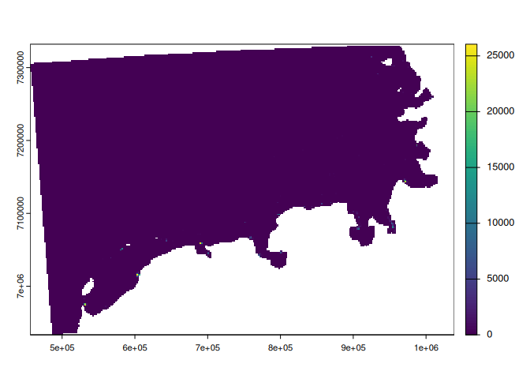

<!-- README.md is generated from README.Rmd. Please edit that file -->

# emodnet.wcs

<!-- badges: start -->

[](https://lifecycle.r-lib.org/articles/stages.html#experimental)
[](https://CRAN.R-project.org/package=emodnet.wcs)
[](https://github.com/EMODnet/emodnet.wcs/actions/workflows/R-CMD-check.yaml)
[](https://codecov.io/gh/EMODnet/emodnet.wcs)
<!-- badges: end -->

The goal of emodnet.wcs is to allow interrogation of and access to
EMODnet geographic raster data in R though the [EMODnet Web Coverage
Services](https://github.com/EMODnet/Web-Service-Documentation#web-coverage-service-wcs).
EMODnet raster datasets, such as habitat maps or bathymetry, are
available through Web Coverage Services (WCS). These data are
continuous, gridded, and often used for spatial visualization or
environmental modeling. See below for available Services (data sources).
This package was developed by Sheffield University as part of EMODnet
Biology WP4.

[Web Coverage services (WCS)](https://www.ogc.org/standards/wcs) is a
standard created by the OGC that refers to the receiving of geospatial
information as ‘coverages’: digital geospatial information representing
space-varying phenomena. One can think of it as Web Feature Service
(WFS) for raster data. It gets the ‘source code’ of the map, but in this
case it’s not raw vectors but raw imagery.

An important distinction must be made between WCS and Web Map Service
(WMS). They are similar, and can return similar formats, but a WCS is
able to return more information, including valuable metadata and more
formats. It additionally allows more precise queries, potentially
against multi-dimensional backend formats.

## Installation

You can install the development version of emodnet.wcs from GitHub with:

``` r
# install.packages("pak")
pak::pak("EMODnet/emodnet.wcs")
```

Load the library

``` r
library(emodnet.wcs)
#> Loading ISO 19139 XML schemas...
#> Loading ISO 19115-3 XML schemas...
#> Loading ISO 19139 codelists...
```

If you want to avoid reading messages from emodnet.wcs such as “WCS
client created successfully”, set the `"emodnet.wcs.quiet"` option to
`TRUE`.

``` r
options("emodnet.wcs.quiet" = TRUE)
```

## Available data sources (services)

All available services are contained in the tibble returned by
`emdn_wcs()`.

| service_name | service_url |
|:---|:---|
| bathymetry | <https://ows.emodnet-bathymetry.eu/wcs> |
| biology | <https://geo.vliz.be/geoserver/Emodnetbio/wcs> |
| human_activities | <https://ows.emodnet-humanactivities.eu/wcs> |
| seabed_habitats | <https://ows.emodnet-seabedhabitats.eu/geoserver/emodnet_open_maplibrary/wcs> |

To explore available services you can use `View()` or your usual way to
explore `data.frames`.

## Connect to a data source: create service client

Create new WCS Client. Specify the service using the `service` argument.

``` r
wcs <- emdn_init_wcs_client(service = "biology")
#> ✔ WCS client created succesfully
#> ℹ Service: <https://geo.vliz.be/geoserver/Emodnetbio/wcs>
#> ℹ Service: "2.0.1"
```

## Get metadata about a service and available data (coverages)

Get service level and a subset of coverage level metadata, compiled for
easy review by supplying a `WCSClient` object to `emdn_get_wcs_info`.

``` r
emdn_get_wcs_info(wcs)
#> $data_source
#> [1] "emodnet_wcs"
#> 
#> $service_name
#> [1] "biology"
#> 
#> $service_url
#> [1] "https://geo.vliz.be/geoserver/Emodnetbio/wcs"
#> 
#> $service_title
#> [1] "EMODnet Biology"
#> 
#> $service_abstract
#> [1] "The EMODnet Biology products include a set of gridded map layers showing the average abundance of marine species for different time windows (seasonal, annual) using geospatial modelling. The spatial modelling tool used to calculate the gridded abundance maps is based on DIVA. DIVA (Data-Interpolating Variational Analysis) is a tool to create gridded data sets from discrete point measurements of the ocean. For the representation of time dynamics, it was decided to produce gridded maps for sliding time windows, e.g. combining one or more years  in one gridded map, so that relatively smooth animated GIF presentations can be produced that show the essential change over time. EMODnet Biology’s data products include the Operational Ocean Products and Services (OOPS), harvested by ICES."
#> 
#> $service_access_constraits
#> [1] "NONE"
#> 
#> $service_fees
#> [1] "NONE"
#> 
#> $service_type
#> [1] "urn:ogc:service:wcs"
#> 
#> $coverage_details
#> # A tibble: 10 × 9
#>    coverage_id           dim_n dim_names extent crs   wgs84_bbox temporal_extent
#>    <chr>                 <int> <chr>     <chr>  <chr> <chr>      <chr>          
#>  1 Emodnetbio__ratio_la…     3 lat(deg)… -75.0… EPSG… -75.05, 3… 1958-02-16T01:…
#>  2 Emodnetbio__aca_spp_…     3 lat(deg)… -75.0… EPSG… -75.05, 3… 1958-02-16T01:…
#>  3 Emodnetbio__cal_fin_…     3 lat(deg)… -75.0… EPSG… -75.05, 3… 1958-02-16T01:…
#>  4 Emodnetbio__cal_hel_…     3 lat(deg)… -75.0… EPSG… -75.05, 3… 1958-02-16T01:…
#>  5 Emodnetbio__met_luc_…     3 lat(deg)… -75.0… EPSG… -75.05, 3… 1958-02-16T01:…
#>  6 Emodnetbio__oit_spp_…     3 lat(deg)… -75.0… EPSG… -75.05, 3… 1958-02-16T01:…
#>  7 Emodnetbio__tem_lon_…     3 lat(deg)… -75.0… EPSG… -75.05, 3… 1958-02-16T01:…
#>  8 Emodnetbio__chli_195…     3 lat(deg)… -75.0… EPSG… -75.05, 3… 1958-02-16T01:…
#>  9 Emodnetbio__tot_lar_…     3 lat(deg)… -75.0… EPSG… -75.05, 3… 1958-02-16T01:…
#> 10 Emodnetbio__tot_sma_…     3 lat(deg)… -75.0… EPSG… -75.05, 3… 1958-02-16T01:…
#> # ℹ 2 more variables: vertical_extent <chr>, subtype <chr>
```

Info can also be extracted using a service name instead of a `WCSClient`
object.

``` r
emdn_get_wcs_info(service = "biology")
#> ✔ WCS client created succesfully
#> ℹ Service: <https://geo.vliz.be/geoserver/Emodnetbio/wcs>
#> ℹ Service: "2.0.1"
#> $data_source
#> [1] "emodnet_wcs"
#> 
#> $service_name
#> [1] "biology"
#> 
#> $service_url
#> [1] "https://geo.vliz.be/geoserver/Emodnetbio/wcs"
#> 
#> $service_title
#> [1] "EMODnet Biology"
#> 
#> $service_abstract
#> [1] "The EMODnet Biology products include a set of gridded map layers showing the average abundance of marine species for different time windows (seasonal, annual) using geospatial modelling. The spatial modelling tool used to calculate the gridded abundance maps is based on DIVA. DIVA (Data-Interpolating Variational Analysis) is a tool to create gridded data sets from discrete point measurements of the ocean. For the representation of time dynamics, it was decided to produce gridded maps for sliding time windows, e.g. combining one or more years  in one gridded map, so that relatively smooth animated GIF presentations can be produced that show the essential change over time. EMODnet Biology’s data products include the Operational Ocean Products and Services (OOPS), harvested by ICES."
#> 
#> $service_access_constraits
#> [1] "NONE"
#> 
#> $service_fees
#> [1] "NONE"
#> 
#> $service_type
#> [1] "urn:ogc:service:wcs"
#> 
#> $coverage_details
#> # A tibble: 10 × 9
#>    coverage_id           dim_n dim_names extent crs   wgs84_bbox temporal_extent
#>    <chr>                 <int> <chr>     <chr>  <chr> <chr>      <chr>          
#>  1 Emodnetbio__ratio_la…     3 lat(deg)… -75.0… EPSG… -75.05, 3… 1958-02-16T01:…
#>  2 Emodnetbio__aca_spp_…     3 lat(deg)… -75.0… EPSG… -75.05, 3… 1958-02-16T01:…
#>  3 Emodnetbio__cal_fin_…     3 lat(deg)… -75.0… EPSG… -75.05, 3… 1958-02-16T01:…
#>  4 Emodnetbio__cal_hel_…     3 lat(deg)… -75.0… EPSG… -75.05, 3… 1958-02-16T01:…
#>  5 Emodnetbio__met_luc_…     3 lat(deg)… -75.0… EPSG… -75.05, 3… 1958-02-16T01:…
#>  6 Emodnetbio__oit_spp_…     3 lat(deg)… -75.0… EPSG… -75.05, 3… 1958-02-16T01:…
#>  7 Emodnetbio__tem_lon_…     3 lat(deg)… -75.0… EPSG… -75.05, 3… 1958-02-16T01:…
#>  8 Emodnetbio__chli_195…     3 lat(deg)… -75.0… EPSG… -75.05, 3… 1958-02-16T01:…
#>  9 Emodnetbio__tot_lar_…     3 lat(deg)… -75.0… EPSG… -75.05, 3… 1958-02-16T01:…
#> 10 Emodnetbio__tot_sma_…     3 lat(deg)… -75.0… EPSG… -75.05, 3… 1958-02-16T01:…
#> # ℹ 2 more variables: vertical_extent <chr>, subtype <chr>
```

Get more detailed coverage metadata about specific coverage.

``` r
emdn_get_coverage_info(
  wcs,
  coverage_ids = "Emodnetbio__aca_spp_19582016_L1"
)
#> # A tibble: 1 × 21
#>   data_source service_name     service_url coverage_id band_description band_uom
#>   <chr>       <chr>            <chr>       <chr>       <chr>            <chr>   
#> 1 emodnet_wcs https://geo.vli… biology     Emodnetbio… relative_abunda… W.m-2.S…
#> # ℹ 15 more variables: constraint <chr>, nil_value <dbl>, dim_n <int>,
#> #   dim_names <chr>, grid_size <chr>, resolution <chr>, extent <chr>,
#> #   crs <chr>, wgs84_extent <chr>, temporal_extent <chr>,
#> #   vertical_extent <chr>, subtype <chr>, fn_seq_rule <chr>,
#> #   fn_start_point <chr>, fn_axis_order <chr>
```

> **Note**
>
> To minimize the number of requests sent to webservices, these
> functions use [`memoise`](https://memoise.r-lib.org/) to cache results
> inside the active R session. To clear the cache, re-start R or run
> `memoise::forget(emdn_get_wcs_info)`/`memoise::forget(emdn_get_coverage_info)`

The package also offers a number of functions for extracting individual
metadata in more usable forms. e.g.

``` r
emdn_get_coverage_ids(wcs)
#>  [1] "Emodnetbio__ratio_large_to_small_19582016_L1_err"
#>  [2] "Emodnetbio__aca_spp_19582016_L1"                 
#>  [3] "Emodnetbio__cal_fin_19582016_L1_err"             
#>  [4] "Emodnetbio__cal_hel_19582016_L1_err"             
#>  [5] "Emodnetbio__met_luc_19582016_L1_err"             
#>  [6] "Emodnetbio__oit_spp_19582016_L1_err"             
#>  [7] "Emodnetbio__tem_lon_19582016_L1_err"             
#>  [8] "Emodnetbio__chli_19582016_L1_err"                
#>  [9] "Emodnetbio__tot_lar_19582016_L1_err"             
#> [10] "Emodnetbio__tot_sma_19582016_L1_err"
```

For more details, please refer to the [Getting metadata about Services &
Coverages](https://emodnet.github.io/emodnet.wcs/articles/metadata.html)
article in the `emodnet.wcs` online documentation.

## Download data (coverages)

The package also provides a function to download full or subsets of
coverages from emodnet.wcs services.

The following example downloads a spatial subset of a coverage using a
bounding box.

``` r
wcs <- emdn_init_wcs_client(service = "human_activities")
#> ✔ WCS client created succesfully
#> ℹ Service: <https://ows.emodnet-humanactivities.eu/wcs>
#> ℹ Service: "2.0.1"

cov <- emdn_get_coverage(
  wcs,
  # pseudomercator (EPSG 3857) in this case:
  crs = "EPSG:3857",
  bbox = c(
    xmin = 484177.9,
    ymin = 6957617.3,
    xmax = 1035747,
    ymax = 7308616.2
  ),
  coverage_id = "emodnet__vesseldensity_all",
  nil_values_as_na = FALSE
)
#> ── Downloading coverage "emodnet__vesseldensity_all" ───────────────────────────
#> No encoding supplied: defaulting to UTF-8.
#> <GMLEnvelope>
#> ....|-- lowerCorner: 484177.9 6957617.3 "2017-01-01T00:00:00"
#> ....|-- upperCorner: 1035747 7308616.2 "2023-12-01T00:00:00"
#> ✔ Coverage "emodnet__vesseldensity_all" downloaded succesfully as a
#>        terra <SpatRaster>
```

``` r
terra::plot(cov)
```



For more details on downloading coverages, please refer to the [Download
Coverages](https://emodnet.github.io/emodnet.wcs/articles/coverages.html)
article in the `emodnet.wcs` online documentation.

## Citation

To cite emodnet.wcs, please use the output from
`citation(package = "emodnet.wcs")`.

``` r
citation(package = "emodnet.wcs")
#> To cite package 'emodnet.wcs' in publications use:
#> 
#>   Krystalli A (2025). _emodnet.wcs: Access EMODnet Web Coverage Service
#>   data through R_. R package version 0.0.0.9012. Integrated data
#>   products created under the European Marine Observation Data Network
#>   (EMODnet) Biology project (EASME/EMFF/2017/1.3.1.2/02/SI2.789013),
#>   funded by the European Union under Regulation (EU) No 508/2014 of the
#>   European Parliament and of the Council of 15 May 2014 on the European
#>   Maritime and Fisheries Fund,
#>   <https://github.com/EMODnet/emodnet.wcs>.
#> 
#> A BibTeX entry for LaTeX users is
#> 
#>   @Manual{,
#>     title = {{emodnet.wcs}: Access EMODnet Web Coverage Service data through R},
#>     author = {Anna Krystalli},
#>     year = {2025},
#>     note = {R package version 0.0.0.9012. Integrated data products created under the European Marine Observation Data Network (EMODnet) Biology project (EASME/EMFF/2017/1.3.1.2/02/SI2.789013), funded by the European Union under Regulation (EU) No 508/2014 of the European Parliament and of the Council of 15 May 2014 on the European Maritime and Fisheries Fund},
#>     url = {https://github.com/EMODnet/emodnet.wcs},
#>   }
```

## Unlock the Full Potential of the EMODnet Web Services: Access Feature and Gridded datasets.

### Access EMODnet’s Web Feature Service data through emodnet.wfs

The goal of [emodnet.wfs](https://docs.ropensci.org/emodnet.wfs) is to
allow interrogation of and access to [EMODnet’s, European Marine
Observation and Data Network, geographic vector
data](https://emodnet.ec.europa.eu/en/emodnet-web-service-documentation#inline-nav-3)
in R through the [EMODnet Web Feature
Services](https://emodnet.ec.europa.eu/en/data-0). [Web Feature services
(WFS)](https://www.ogc.org/standards/wfs/) represent a change in the way
geographic information is created, modified and exchanged on the
Internet and offer direct fine-grained access to geographic information
at the feature and feature property level. Features are representation
of geographic entities, such as a coastlines, marine protected areas,
offshore platforms, or fishing areas. In WFS, features have geometry
(spatial information) and attributes (descriptive data). emodnet.wfs
aims at offering an user-friendly interface to this rich data.

### Access EMODnet gridded and tabular datasets through the ERDDAP Server and rerddap in R

Both WFS and WCS EMODnet services are based on a federated system: each
EMODnet thematic lot manages their servers and data, ensuring that their
data are exposed both via WFS and WCS. The twin R packages `emodnet.wfs`
and `emodnet.wcs` simplify the access to all the entry points by
collecting them in single places, which are the packages themselves.

In contrast, the [EMODnet ERDDAP Server](https://erddap.emodnet.eu) is
centrally managed by the EMODnet Central Portal, offering a single
access point to all gridded and tabular datasets. ERDDAP simplifies
access to datasets such as digital terrain models, vessel density or
environmental data. It is particularly suited for large-scale,
multidimensional data analysis. In R, the `rerddap` package allows users
to query and subset ERDDAP data programmatically, enabling efficient
analysis and integration into workflows. For example, researchers can
retrieve datasets on vessel density.

``` r
# install.packages("rerrdap")
library(rerddap)
#> Registered S3 method overwritten by 'hoardr':
#>   method           from
#>   print.cache_info httr

# This is the url where the EMODnet ERDDAP server is located
erddap_url <- "https://erddap.emodnet.eu/erddap/"

# Inspect all available datasets
ed_datasets(url = erddap_url)
#> # A tibble: 8 × 16
#>   griddap Subset tabledap Make.A.Graph wms   files Title Summary FGDC  ISO.19115
#>   <chr>   <chr>  <chr>    <chr>        <chr> <chr> <chr> <chr>   <chr> <chr>    
#> 1 ""      "/erd… /erddap… /erddap/tab… ""    ""    * Th… "This … ""    ""       
#> 2 ""      ""     /erddap… /erddap/tab… ""    "/er… EMOD… "The d… ""    ""       
#> 3 ""      ""     /erddap… /erddap/tab… ""    "/er… EMOD… "The d… ""    ""       
#> 4 ""      "/erd… /erddap… /erddap/tab… ""    "/er… EMOD… "The d… "/er… "/erddap…
#> 5 ""      ""     /erddap… /erddap/tab… ""    "/er… Pres… "The p… "/er… "/erddap…
#> 6 ""      ""     /erddap… /erddap/tab… ""    ""    PSMS… "Perma… ""    ""       
#> 7 ""      ""     /erddap… /erddap/tab… ""    "/er… PSMS… "Perma… ""    ""       
#> 8 ""      "/erd… /erddap… /erddap/tab… ""    "/er… TAO/… "This … "/er… "/erddap…
#> # ℹ 6 more variables: Info <chr>, Background.Info <chr>, RSS <chr>,
#> #   Email <chr>, Institution <chr>, Dataset.ID <chr>

# Find datasets with the key words "vessel density"
ed_search(query = "vessel density", url = erddap_url)
#> # A tibble: 16 × 2
#>    title                                                     dataset_id         
#>    <chr>                                                     <chr>              
#>  1 Vessel Density                                            humanactivities_9f…
#>  2 Vessel Density                                            humanactivities_e9…
#>  3 Vessel traffic density, 2019, All                         EMODPACE_VD_All    
#>  4 Vessel traffic density, 2019, Cargo                       EMODPACE_VD_09_Car…
#>  5 Vessel traffic density, 2019, Dredging or underwater ops  EMODPACE_VD_03_Dre…
#>  6 Vessel traffic density, 2019, Fishing                     EMODPACE_VD_01_Fis…
#>  7 Vessel traffic density, 2019, High Speed craft            EMODPACE_VD_06_High
#>  8 Vessel traffic density, 2019, Miliary and law enforcement EMODPACE_VD_11_Mil…
#>  9 Vessel traffic density, 2019, Other                       EMODPACE_VD_00_Oth…
#> 10 Vessel traffic density, 2019, Passenger                   EMODPACE_VD_08_Pas…
#> 11 Vessel traffic density, 2019, Pleasure craft              EMODPACE_VD_05_Ple…
#> 12 Vessel traffic density, 2019, Sailing                     EMODPACE_VD_04_Sai…
#> 13 Vessel traffic density, 2019, Service                     EMODPACE_VD_02_Ser…
#> 14 Vessel traffic density, 2019, Tanker                      EMODPACE_VD_10_Tan…
#> 15 Vessel traffic density, 2019, Tug and Towing              EMODPACE_VD_07_Tug 
#> 16 Vessel traffic density, 2019, Unknown                     EMODPACE_VD_12_Unk…

# Inspect more info about the vessel density dataset, using its identifier
human_activities_data_info <- info(
  datasetid = "humanactivities_9f8a_3389_f08a",
  url = erddap_url
)
human_activities_data_info
#> <ERDDAP info> humanactivities_9f8a_3389_f08a 
#>  Base URL: https://erddap.emodnet.eu/erddap 
#>  Dataset Type: griddap 
#>  Dimensions (range):  
#>      time: (2017-01-01T00:00:00Z, 2021-12-01T00:00:00Z) 
#>      y: (604500.0, 7034500.0) 
#>      x: (-622500.0, 6884500.0) 
#>  Variables:  
#>      vd: 
#>          Units: seconds

# Retrieve the vessel density at a particular time period
year_2020_gridded_data <- griddap(
  datasetx = human_activities_data_info,
  time = c("2020-03-18", "2020-03-19")
)
#> info() output passed to x; setting base url to: https://erddap.emodnet.eu/erddap
head(year_2020_gridded_data$data)
#>         x       y                 time vd
#> 1 -622500 7034500 2020-04-01T00:00:00Z NA
#> 2 -621500 7034500 2020-04-01T00:00:00Z NA
#> 3 -620500 7034500 2020-04-01T00:00:00Z NA
#> 4 -619500 7034500 2020-04-01T00:00:00Z NA
#> 5 -618500 7034500 2020-04-01T00:00:00Z NA
#> 6 -617500 7034500 2020-04-01T00:00:00Z NA
```

More functionalities are available through `rerddap`. Feel free to
explore the [rerddap website](https://docs.ropensci.org/rerddap/) to
find out what else can you do with the EMODnet datasets in ERDDAP.

## Code of Conduct

Please note that the emodnet.wcs project is released with a [Contributor
Code of
Conduct](https://emodnet.github.io/emodnet.wcs/CODE_OF_CONDUCT.html). By
contributing to this project, you agree to abide by its terms.
